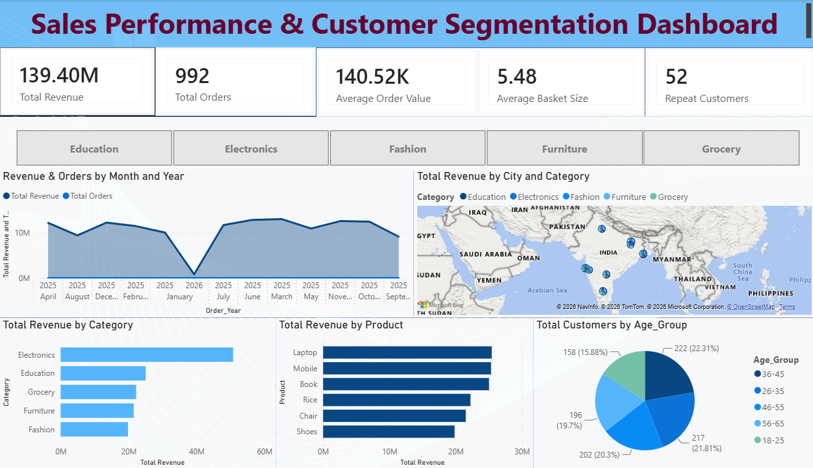

# 📊 Task 3 – Deep-Dive Analysis & Interactive Dashboarding


---

## 📌 Project Overview

This repository contains my submission for **Task 3 – Deep-Dive Analysis & Interactive Dashboarding**, completed as part of the **ApexPlanet Data Analytics Internship Program**.

The primary objective of this task was to perform a detailed analysis of sales and customer data, identify important business performance indicators, analyze customer segments and product performance, and develop an interactive **Power BI Business Intelligence dashboard**.

The project focuses on transforming raw sales data into meaningful business insights through:

- 📊 KPI development
- 👥 Customer segmentation
- 📈 Sales trend analysis
- 🌍 Geographic analysis
- 🛍️ Product and category analysis
- 📅 Time-based analysis
- 🎛️ Interactive filtering
- 💡 Business recommendations

---

# 🎯 Project Objectives

The major objectives of this task were:

- Define meaningful **Key Performance Indicators (KPIs)**.
- Analyze overall sales and order performance.
- Perform customer segmentation based on demographic and purchasing characteristics.
- Identify high-performing product categories.
- Analyze product-level revenue contribution.
- Compare revenue performance across cities.
- Analyze customer distribution by age group.
- Identify sales trends over time.
- Develop an interactive Power BI dashboard.
- Generate actionable business insights from the analysis.

---

# 🔗 Live Interactive Dashboard

🌐 **View Live Power BI Dashboard:**

[**Click Here to View Interactive Dashboard**](https://app.powerbi.com/)

---

# 📊 Dashboard Preview



### Dashboard Title

**Sales Performance & Customer Segmentation Dashboard**

The dashboard provides a consolidated view of sales performance, customer behavior, product performance, category revenue, geographic distribution, and customer demographics.

---

# 📐 Key Performance Indicators (KPIs)

The dashboard tracks five major business KPIs.

## 💰 1. Total Revenue

### **139.40M**

Represents the total revenue generated from all recorded sales transactions.

**Business Purpose:**

Helps evaluate the overall financial performance of the business and provides a high-level view of total sales generated.

---

## 🛒 2. Total Orders

### **992**

Represents the total number of orders recorded in the dataset.

**Business Purpose:**

Helps measure sales activity and understand overall customer transaction volume.

---

## 📊 3. Average Order Value (AOV)

### **140.52K**

Average revenue generated per order.

**Formula:**

```text
AOV = Total Revenue / Total Orders
